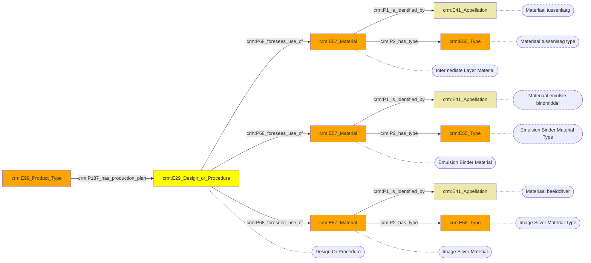

```mermaid
graph LR
57576f3e-8a0b-11ee-b60e-00163e71351b["crm:E57_Material"]-->|"crm:P1_is_identified_by"|d5c96a2e-dc89-11ee-988e-960002548b4f["crm:E41_Appellation"]
57576f3e-8a0b-11ee-b60e-00163e71351b["crm:E57_Material"]-->|"crm:P2_has_type"|bc3bcb84-dc89-11ee-a6ff-960002548b4f["crm:E55_Type"]
7620b8f8-5225-11ee-974d-00163e71351b["crm:E29_Design_or_Procedure"]-->|"crm:P68_foresees_use_of"|57576f3e-8a0b-11ee-b60e-00163e71351b["crm:E57_Material"]
7620b8f8-5225-11ee-974d-00163e71351b["crm:E29_Design_or_Procedure"]-->|"crm:P68_foresees_use_of"|a2bb964e-8a0b-11ee-b60e-00163e71351b["crm:E57_Material"]
7620b8f8-5225-11ee-974d-00163e71351b["crm:E29_Design_or_Procedure"]-->|"crm:P68_foresees_use_of"|c0bca660-8a0b-11ee-a49f-00163e71351b["crm:E57_Material"]
7892caec-471a-11ee-a9ac-00163e71351b["crm:E99_Product_Type"]-->|"crm:P187_has_production_plan"|7620b8f8-5225-11ee-974d-00163e71351b["crm:E29_Design_or_Procedure"]
a2bb964e-8a0b-11ee-b60e-00163e71351b["crm:E57_Material"]-->|"crm:P1_is_identified_by"|91df1d15-dc89-11ee-b920-960002548b4f["crm:E41_Appellation"]
a2bb964e-8a0b-11ee-b60e-00163e71351b["crm:E57_Material"]-->|"crm:P2_has_type"|6f574f22-dc89-11ee-b0a4-960002548b4f["crm:E55_Type"]
c0bca660-8a0b-11ee-a49f-00163e71351b["crm:E57_Material"]-->|"crm:P1_is_identified_by"|eba53ad0-dc88-11ee-be52-960002548b4f["crm:E41_Appellation"]
c0bca660-8a0b-11ee-a49f-00163e71351b["crm:E57_Material"]-->|"crm:P2_has_type"|ca33d592-dc88-11ee-a42e-960002548b4f["crm:E55_Type"]
d5c96a2e-dc89-11ee-988e-960002548b4f["crm:E41_Appellation"]-.-d5c96a2e-dc89-11ee-988e-960002548b4f_s(["Materiaal tussenlaag"])
bc3bcb84-dc89-11ee-a6ff-960002548b4f["crm:E55_Type"]-.-bc3bcb84-dc89-11ee-a6ff-960002548b4f_s(["Materiaal tussenlaag type"])
57576f3e-8a0b-11ee-b60e-00163e71351b["crm:E57_Material"]-.-57576f3e-8a0b-11ee-b60e-00163e71351b_s(["Intermediate Layer  Material"])
a2bb964e-8a0b-11ee-b60e-00163e71351b["crm:E57_Material"]-.-a2bb964e-8a0b-11ee-b60e-00163e71351b_s(["Emulsion Binder Material"])
c0bca660-8a0b-11ee-a49f-00163e71351b["crm:E57_Material"]-.-c0bca660-8a0b-11ee-a49f-00163e71351b_s(["Image Silver Material"])
7620b8f8-5225-11ee-974d-00163e71351b["crm:E29_Design_or_Procedure"]-.-7620b8f8-5225-11ee-974d-00163e71351b_s(["Design Or Procedure"])
91df1d15-dc89-11ee-b920-960002548b4f["crm:E41_Appellation"]-.-91df1d15-dc89-11ee-b920-960002548b4f_s(["Materiaal emulsie bindmiddel"])
6f574f22-dc89-11ee-b0a4-960002548b4f["crm:E55_Type"]-.-6f574f22-dc89-11ee-b0a4-960002548b4f_s(["Emulsion Binder Material Type"])
eba53ad0-dc88-11ee-be52-960002548b4f["crm:E41_Appellation"]-.-eba53ad0-dc88-11ee-be52-960002548b4f_s(["Materiaal beeldzilver"])
ca33d592-dc88-11ee-a42e-960002548b4f["crm:E55_Type"]-.-ca33d592-dc88-11ee-a42e-960002548b4f_s(["Image Silver Material Type"])
style d5c96a2e-dc89-11ee-988e-960002548b4f_s stroke-dasharray: 5
style bc3bcb84-dc89-11ee-a6ff-960002548b4f_s stroke-dasharray: 5
style 57576f3e-8a0b-11ee-b60e-00163e71351b_s stroke-dasharray: 5
style a2bb964e-8a0b-11ee-b60e-00163e71351b_s stroke-dasharray: 5
style c0bca660-8a0b-11ee-a49f-00163e71351b_s stroke-dasharray: 5
style 7620b8f8-5225-11ee-974d-00163e71351b_s stroke-dasharray: 5
style 91df1d15-dc89-11ee-b920-960002548b4f_s stroke-dasharray: 5
style 6f574f22-dc89-11ee-b0a4-960002548b4f_s stroke-dasharray: 5
style eba53ad0-dc88-11ee-be52-960002548b4f_s stroke-dasharray: 5
style ca33d592-dc88-11ee-a42e-960002548b4f_s stroke-dasharray: 5
style 57576f3e-8a0b-11ee-b60e-00163e71351b fill:#ffa500
style 6f574f22-dc89-11ee-b0a4-960002548b4f fill:#ffa500
style 7620b8f8-5225-11ee-974d-00163e71351b fill:#ffff00
style 7892caec-471a-11ee-a9ac-00163e71351b fill:#ffa500
style 91df1d15-dc89-11ee-b920-960002548b4f fill:#EEE8AA
style a2bb964e-8a0b-11ee-b60e-00163e71351b fill:#ffa500
style bc3bcb84-dc89-11ee-a6ff-960002548b4f fill:#ffa500
style c0bca660-8a0b-11ee-a49f-00163e71351b fill:#ffa500
style ca33d592-dc88-11ee-a42e-960002548b4f fill:#ffa500
style d5c96a2e-dc89-11ee-988e-960002548b4f fill:#EEE8AA
style eba53ad0-dc88-11ee-be52-960002548b4f fill:#EEE8AA
```
