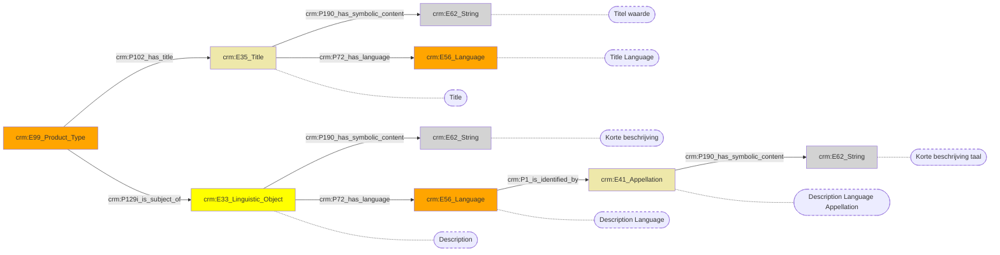

```mermaid
graph LR
style 335a7fea-522f-11ee-974d-00163e71351b fill:#ffff00
style 335a836e-522f-11ee-974d-00163e71351b fill:#D3D3D3
style 335a867a-522f-11ee-974d-00163e71351b fill:#EEE8AA
style 335a8760-522f-11ee-974d-00163e71351b fill:#ffa500
style 3729b9a5-e767-11ee-b748-960002548b4f fill:#D3D3D3
style 7892caec-471a-11ee-a9ac-00163e71351b fill:#ffa500
style 9d479c02-5230-11ee-a9ac-00163e71351b fill:#EEE8AA
style 9d47a116-5230-11ee-a9ac-00163e71351b fill:#D3D3D3
style 9d47a2f6-5230-11ee-a9ac-00163e71351b fill:#ffa500
335a7fea-522f-11ee-974d-00163e71351b["crm:E33_Linguistic_Object"]-->|"crm:P190_has_symbolic_content"|335a836e-522f-11ee-974d-00163e71351b["crm:E62_String"]
335a7fea-522f-11ee-974d-00163e71351b["crm:E33_Linguistic_Object"]-->|"crm:P72_has_language"|335a8760-522f-11ee-974d-00163e71351b["crm:E56_Language"]
335a867a-522f-11ee-974d-00163e71351b["crm:E41_Appellation"]-->|"crm:P190_has_symbolic_content"|3729b9a5-e767-11ee-b748-960002548b4f["crm:E62_String"]
335a8760-522f-11ee-974d-00163e71351b["crm:E56_Language"]-->|"crm:P1_is_identified_by"|335a867a-522f-11ee-974d-00163e71351b["crm:E41_Appellation"]
7892caec-471a-11ee-a9ac-00163e71351b["crm:E99_Product_Type"]-->|"crm:P102_has_title"|9d479c02-5230-11ee-a9ac-00163e71351b["crm:E35_Title"]
7892caec-471a-11ee-a9ac-00163e71351b["crm:E99_Product_Type"]-->|"crm:P129i_is_subject_of"|335a7fea-522f-11ee-974d-00163e71351b["crm:E33_Linguistic_Object"]
9d479c02-5230-11ee-a9ac-00163e71351b["crm:E35_Title"]-->|"crm:P190_has_symbolic_content"|9d47a116-5230-11ee-a9ac-00163e71351b["crm:E62_String"]
9d479c02-5230-11ee-a9ac-00163e71351b["crm:E35_Title"]-->|"crm:P72_has_language"|9d47a2f6-5230-11ee-a9ac-00163e71351b["crm:E56_Language"]
style 335a836e-522f-11ee-974d-00163e71351b_s stroke-dasharray: 5
style 335a8760-522f-11ee-974d-00163e71351b_s stroke-dasharray: 5
style 3729b9a5-e767-11ee-b748-960002548b4f_s stroke-dasharray: 5
style 335a867a-522f-11ee-974d-00163e71351b_s stroke-dasharray: 5
style 9d479c02-5230-11ee-a9ac-00163e71351b_s stroke-dasharray: 5
style 335a7fea-522f-11ee-974d-00163e71351b_s stroke-dasharray: 5
style 9d47a116-5230-11ee-a9ac-00163e71351b_s stroke-dasharray: 5
style 9d47a2f6-5230-11ee-a9ac-00163e71351b_s stroke-dasharray: 5
335a836e-522f-11ee-974d-00163e71351b["crm:E62_String"]-.-335a836e-522f-11ee-974d-00163e71351b_s(["Korte beschrijving"])
335a8760-522f-11ee-974d-00163e71351b["crm:E56_Language"]-.-335a8760-522f-11ee-974d-00163e71351b_s(["Description Language"])
3729b9a5-e767-11ee-b748-960002548b4f["crm:E62_String"]-.-3729b9a5-e767-11ee-b748-960002548b4f_s(["Korte beschrijving taal"])
335a867a-522f-11ee-974d-00163e71351b["crm:E41_Appellation"]-.-335a867a-522f-11ee-974d-00163e71351b_s(["Description Language Appellation"])
9d479c02-5230-11ee-a9ac-00163e71351b["crm:E35_Title"]-.-9d479c02-5230-11ee-a9ac-00163e71351b_s(["Title"])
335a7fea-522f-11ee-974d-00163e71351b["crm:E33_Linguistic_Object"]-.-335a7fea-522f-11ee-974d-00163e71351b_s(["Description"])
9d47a116-5230-11ee-a9ac-00163e71351b["crm:E62_String"]-.-9d47a116-5230-11ee-a9ac-00163e71351b_s(["Titel waarde"])
9d47a2f6-5230-11ee-a9ac-00163e71351b["crm:E56_Language"]-.-9d47a2f6-5230-11ee-a9ac-00163e71351b_s(["Title Language"])
```
