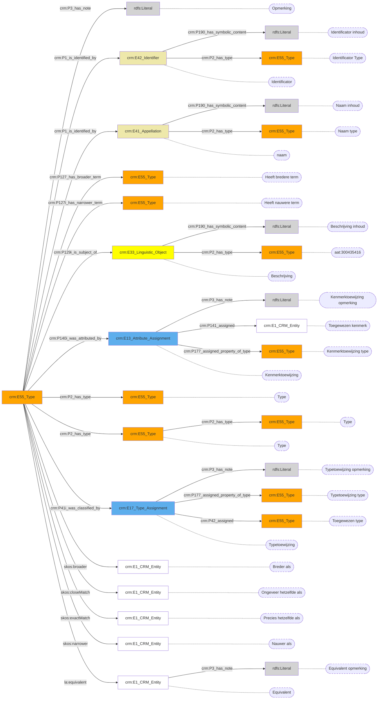

```mermaid
graph LR
2f941ad1-18e4-11ef-8836-960002548b4f["crm:E42_Identifier"]-->|"crm:P190_has_symbolic_content"|2f942006-18e4-11ef-ac7a-960002548b4f(rdfs:Literal)
3d9e158f-1765-11ef-bd9c-960002548b4f["crm:E41_Appellation"]-->|"crm:P190_has_symbolic_content"|3d9e2cbf-1765-11ef-97a0-960002548b4f(rdfs:Literal)
3d9e197d-1765-11ef-aa40-960002548b4f["crm:E13_Attribute_Assignment"]-->|"crm:P3_has_note"|3d9e2e84-1765-11ef-90c0-960002548b4f(rdfs:Literal)
3d9e1db4-1765-11ef-b3c8-960002548b4f["crm:E17_Type_Assignment"]-->|"crm:P3_has_note"|21ebf8dc-181c-11ef-87df-960002548b4f(rdfs:Literal)
3d9e1f8b-1765-11ef-a1f7-960002548b4f["crm:E1_CRM_Entity"]-->|"crm:P3_has_note"|0e3a0ca7-6922-11ef-80a5-960002548b4f(rdfs:Literal)
3d9e2501-1765-11ef-853e-960002548b4f["crm:E33_Linguistic_Object"]-->|"crm:P190_has_symbolic_content"|3d9e341a-1765-11ef-92c9-960002548b4f(rdfs:Literal)
3d9e2b00-1765-11ef-a104-960002548b4f["crm:E55_Type"]-->|"crm:P3_has_note"|3d9e1bbc-1765-11ef-887b-960002548b4f(rdfs:Literal)
2f941ad1-18e4-11ef-8836-960002548b4f["crm:E42_Identifier"]-->|"crm:P2_has_type"|2f94220d-18e4-11ef-94d2-960002548b4f["crm:E55_Type"]
3d9e158f-1765-11ef-bd9c-960002548b4f["crm:E41_Appellation"]-->|"crm:P2_has_type"|3d9e2bdb-1765-11ef-a9f8-960002548b4f["crm:E55_Type"]
3d9e197d-1765-11ef-aa40-960002548b4f["crm:E13_Attribute_Assignment"]-->|"crm:P141_assigned"|3d9e2d33-1765-11ef-8db4-960002548b4f["crm:E1_CRM_Entity"]
3d9e197d-1765-11ef-aa40-960002548b4f["crm:E13_Attribute_Assignment"]-->|"crm:P177_assigned_property_of_type"|3d9e2da0-1765-11ef-b996-960002548b4f["crm:E55_Type"]
3d9e1db4-1765-11ef-b3c8-960002548b4f["crm:E17_Type_Assignment"]-->|"crm:P177_assigned_property_of_type"|3d9e2ef2-1765-11ef-a1cb-960002548b4f["crm:E55_Type"]
3d9e1db4-1765-11ef-b3c8-960002548b4f["crm:E17_Type_Assignment"]-->|"crm:P42_assigned"|3d9e2e17-1765-11ef-b169-960002548b4f["crm:E55_Type"]
3d9e2501-1765-11ef-853e-960002548b4f["crm:E33_Linguistic_Object"]-->|"crm:P2_has_type"|3d9e34f8-1765-11ef-9acc-960002548b4f["crm:E55_Type"]
3d9e26d6-1765-11ef-8ed4-960002548b4f["crm:E55_Type"]-->|"crm:P2_has_type"|3d9e318a-1765-11ef-b206-960002548b4f["crm:E55_Type"]
3d9e2b00-1765-11ef-a104-960002548b4f["crm:E55_Type"]-->|"crm:P1_is_identified_by"|2f941ad1-18e4-11ef-8836-960002548b4f["crm:E42_Identifier"]
3d9e2b00-1765-11ef-a104-960002548b4f["crm:E55_Type"]-->|"crm:P1_is_identified_by"|3d9e158f-1765-11ef-bd9c-960002548b4f["crm:E41_Appellation"]
3d9e2b00-1765-11ef-a104-960002548b4f["crm:E55_Type"]-->|"crm:P127_has_broader_term"|3d9e1180-1765-11ef-97c6-960002548b4f["crm:E55_Type"]
3d9e2b00-1765-11ef-a104-960002548b4f["crm:E55_Type"]-->|"crm:P127i_has_narrower_term"|3d9e215e-1765-11ef-841b-960002548b4f["crm:E55_Type"]
3d9e2b00-1765-11ef-a104-960002548b4f["crm:E55_Type"]-->|"crm:P129i_is_subject_of"|3d9e2501-1765-11ef-853e-960002548b4f["crm:E33_Linguistic_Object"]
3d9e2b00-1765-11ef-a104-960002548b4f["crm:E55_Type"]-->|"crm:P140i_was_attributed_by"|3d9e197d-1765-11ef-aa40-960002548b4f["crm:E13_Attribute_Assignment"]
3d9e2b00-1765-11ef-a104-960002548b4f["crm:E55_Type"]-->|"crm:P2_has_type"|3d9e2332-1765-11ef-b178-960002548b4f["crm:E55_Type"]
3d9e2b00-1765-11ef-a104-960002548b4f["crm:E55_Type"]-->|"crm:P2_has_type"|3d9e26d6-1765-11ef-8ed4-960002548b4f["crm:E55_Type"]
3d9e2b00-1765-11ef-a104-960002548b4f["crm:E55_Type"]-->|"crm:P41i_was_classified_by"|3d9e1db4-1765-11ef-b3c8-960002548b4f["crm:E17_Type_Assignment"]
3d9e2b00-1765-11ef-a104-960002548b4f["crm:E55_Type"]-->|"skos:broader"|6af52c5d-1da9-11ef-8cb3-960002548b4f["crm:E1_CRM_Entity"]
3d9e2b00-1765-11ef-a104-960002548b4f["crm:E55_Type"]-->|"skos:closeMatch"|e0a5a580-1da9-11ef-9325-960002548b4f["crm:E1_CRM_Entity"]
3d9e2b00-1765-11ef-a104-960002548b4f["crm:E55_Type"]-->|"skos:exactMatch"|bd929d8c-1da9-11ef-bb59-960002548b4f["crm:E1_CRM_Entity"]
3d9e2b00-1765-11ef-a104-960002548b4f["crm:E55_Type"]-->|"skos:narrower"|a2df92d1-1da9-11ef-9c02-960002548b4f["crm:E1_CRM_Entity"]
3d9e2b00-1765-11ef-a104-960002548b4f["crm:E55_Type"]-->|"la:equivalent"|3d9e1f8b-1765-11ef-a1f7-960002548b4f["crm:E1_CRM_Entity"]
style 0e3a0ca7-6922-11ef-80a5-960002548b4f fill:#D3D3D3
style 21ebf8dc-181c-11ef-87df-960002548b4f fill:#D3D3D3
style 2f941ad1-18e4-11ef-8836-960002548b4f fill:#EEE8AA
style 2f942006-18e4-11ef-ac7a-960002548b4f fill:#D3D3D3
style 2f94220d-18e4-11ef-94d2-960002548b4f fill:#ffa500
style 3d9e1180-1765-11ef-97c6-960002548b4f fill:#ffa500
style 3d9e158f-1765-11ef-bd9c-960002548b4f fill:#EEE8AA
style 3d9e197d-1765-11ef-aa40-960002548b4f fill:#5DAEEC
style 3d9e1bbc-1765-11ef-887b-960002548b4f fill:#D3D3D3
style 3d9e1db4-1765-11ef-b3c8-960002548b4f fill:#5DAEEC
style 3d9e1f8b-1765-11ef-a1f7-960002548b4f fill:#ffffff
style 3d9e215e-1765-11ef-841b-960002548b4f fill:#ffa500
style 3d9e2332-1765-11ef-b178-960002548b4f fill:#ffa500
style 3d9e2501-1765-11ef-853e-960002548b4f fill:#ffff00
style 3d9e26d6-1765-11ef-8ed4-960002548b4f fill:#ffa500
style 3d9e2b00-1765-11ef-a104-960002548b4f fill:#ffa500
style 3d9e2bdb-1765-11ef-a9f8-960002548b4f fill:#ffa500
style 3d9e2cbf-1765-11ef-97a0-960002548b4f fill:#D3D3D3
style 3d9e2d33-1765-11ef-8db4-960002548b4f fill:#ffffff
style 3d9e2da0-1765-11ef-b996-960002548b4f fill:#ffa500
style 3d9e2e17-1765-11ef-b169-960002548b4f fill:#ffa500
style 3d9e2e84-1765-11ef-90c0-960002548b4f fill:#D3D3D3
style 3d9e2ef2-1765-11ef-a1cb-960002548b4f fill:#ffa500
style 3d9e318a-1765-11ef-b206-960002548b4f fill:#ffa500
style 3d9e341a-1765-11ef-92c9-960002548b4f fill:#D3D3D3
style 3d9e34f8-1765-11ef-9acc-960002548b4f fill:#ffa500
style 6af52c5d-1da9-11ef-8cb3-960002548b4f fill:#ffffff
style a2df92d1-1da9-11ef-9c02-960002548b4f fill:#ffffff
style bd929d8c-1da9-11ef-bb59-960002548b4f fill:#ffffff
style e0a5a580-1da9-11ef-9325-960002548b4f fill:#ffffff
style 2f942006-18e4-11ef-ac7a-960002548b4f_s stroke-dasharray: 5
style 2f94220d-18e4-11ef-94d2-960002548b4f_s stroke-dasharray: 5
style 3d9e2cbf-1765-11ef-97a0-960002548b4f_s stroke-dasharray: 5
style 3d9e2bdb-1765-11ef-a9f8-960002548b4f_s stroke-dasharray: 5
style 3d9e2d33-1765-11ef-8db4-960002548b4f_s stroke-dasharray: 5
style 3d9e2da0-1765-11ef-b996-960002548b4f_s stroke-dasharray: 5
style 3d9e2e84-1765-11ef-90c0-960002548b4f_s stroke-dasharray: 5
style 3d9e2ef2-1765-11ef-a1cb-960002548b4f_s stroke-dasharray: 5
style 21ebf8dc-181c-11ef-87df-960002548b4f_s stroke-dasharray: 5
style 3d9e2e17-1765-11ef-b169-960002548b4f_s stroke-dasharray: 5
style 0e3a0ca7-6922-11ef-80a5-960002548b4f_s stroke-dasharray: 5
style 3d9e341a-1765-11ef-92c9-960002548b4f_s stroke-dasharray: 5
style 3d9e34f8-1765-11ef-9acc-960002548b4f_s stroke-dasharray: 5
style 3d9e318a-1765-11ef-b206-960002548b4f_s stroke-dasharray: 5
style 2f941ad1-18e4-11ef-8836-960002548b4f_s stroke-dasharray: 5
style 3d9e158f-1765-11ef-bd9c-960002548b4f_s stroke-dasharray: 5
style 3d9e1180-1765-11ef-97c6-960002548b4f_s stroke-dasharray: 5
style 3d9e215e-1765-11ef-841b-960002548b4f_s stroke-dasharray: 5
style 3d9e2501-1765-11ef-853e-960002548b4f_s stroke-dasharray: 5
style 3d9e197d-1765-11ef-aa40-960002548b4f_s stroke-dasharray: 5
style 3d9e2332-1765-11ef-b178-960002548b4f_s stroke-dasharray: 5
style 3d9e26d6-1765-11ef-8ed4-960002548b4f_s stroke-dasharray: 5
style 3d9e1bbc-1765-11ef-887b-960002548b4f_s stroke-dasharray: 5
style 3d9e1db4-1765-11ef-b3c8-960002548b4f_s stroke-dasharray: 5
style 6af52c5d-1da9-11ef-8cb3-960002548b4f_s stroke-dasharray: 5
style e0a5a580-1da9-11ef-9325-960002548b4f_s stroke-dasharray: 5
style bd929d8c-1da9-11ef-bb59-960002548b4f_s stroke-dasharray: 5
style a2df92d1-1da9-11ef-9c02-960002548b4f_s stroke-dasharray: 5
style 3d9e1f8b-1765-11ef-a1f7-960002548b4f_s stroke-dasharray: 5
2f942006-18e4-11ef-ac7a-960002548b4f["rdfs:Literal"]-.-2f942006-18e4-11ef-ac7a-960002548b4f_s(["Identificator inhoud"])
2f94220d-18e4-11ef-94d2-960002548b4f["crm:E55_Type"]-.-2f94220d-18e4-11ef-94d2-960002548b4f_s(["Identificator Type"])
3d9e2cbf-1765-11ef-97a0-960002548b4f["rdfs:Literal"]-.-3d9e2cbf-1765-11ef-97a0-960002548b4f_s(["Naam inhoud"])
3d9e2bdb-1765-11ef-a9f8-960002548b4f["crm:E55_Type"]-.-3d9e2bdb-1765-11ef-a9f8-960002548b4f_s(["Naam type"])
3d9e2d33-1765-11ef-8db4-960002548b4f["crm:E1_CRM_Entity"]-.-3d9e2d33-1765-11ef-8db4-960002548b4f_s(["Toegewezen kenmerk"])
3d9e2da0-1765-11ef-b996-960002548b4f["crm:E55_Type"]-.-3d9e2da0-1765-11ef-b996-960002548b4f_s(["Kenmerktoewijzing type"])
3d9e2e84-1765-11ef-90c0-960002548b4f["rdfs:Literal"]-.-3d9e2e84-1765-11ef-90c0-960002548b4f_s(["Kenmerktoewijzing opmerking"])
3d9e2ef2-1765-11ef-a1cb-960002548b4f["crm:E55_Type"]-.-3d9e2ef2-1765-11ef-a1cb-960002548b4f_s(["Typetoewijzing type"])
21ebf8dc-181c-11ef-87df-960002548b4f["rdfs:Literal"]-.-21ebf8dc-181c-11ef-87df-960002548b4f_s(["Typetoewijzing opmerking"])
3d9e2e17-1765-11ef-b169-960002548b4f["crm:E55_Type"]-.-3d9e2e17-1765-11ef-b169-960002548b4f_s(["Toegewezen type"])
0e3a0ca7-6922-11ef-80a5-960002548b4f["rdfs:Literal"]-.-0e3a0ca7-6922-11ef-80a5-960002548b4f_s(["Equivalent opmerking"])
3d9e341a-1765-11ef-92c9-960002548b4f["rdfs:Literal"]-.-3d9e341a-1765-11ef-92c9-960002548b4f_s(["Beschrijving inhoud"])
3d9e34f8-1765-11ef-9acc-960002548b4f["crm:E55_Type"]-.-3d9e34f8-1765-11ef-9acc-960002548b4f_s(["aat:300435416"])
3d9e318a-1765-11ef-b206-960002548b4f["crm:E55_Type"]-.-3d9e318a-1765-11ef-b206-960002548b4f_s(["Type"])
2f941ad1-18e4-11ef-8836-960002548b4f["crm:E42_Identifier"]-.-2f941ad1-18e4-11ef-8836-960002548b4f_s(["Identificator"])
3d9e158f-1765-11ef-bd9c-960002548b4f["crm:E41_Appellation"]-.-3d9e158f-1765-11ef-bd9c-960002548b4f_s(["naam"])
3d9e1180-1765-11ef-97c6-960002548b4f["crm:E55_Type"]-.-3d9e1180-1765-11ef-97c6-960002548b4f_s(["Heeft bredere term"])
3d9e215e-1765-11ef-841b-960002548b4f["crm:E55_Type"]-.-3d9e215e-1765-11ef-841b-960002548b4f_s(["Heeft nauwere term"])
3d9e2501-1765-11ef-853e-960002548b4f["crm:E33_Linguistic_Object"]-.-3d9e2501-1765-11ef-853e-960002548b4f_s(["Beschrijving"])
3d9e197d-1765-11ef-aa40-960002548b4f["crm:E13_Attribute_Assignment"]-.-3d9e197d-1765-11ef-aa40-960002548b4f_s(["Kenmerktoewijzing"])
3d9e2332-1765-11ef-b178-960002548b4f["crm:E55_Type"]-.-3d9e2332-1765-11ef-b178-960002548b4f_s(["Type"])
3d9e26d6-1765-11ef-8ed4-960002548b4f["crm:E55_Type"]-.-3d9e26d6-1765-11ef-8ed4-960002548b4f_s(["Type"])
3d9e1bbc-1765-11ef-887b-960002548b4f["rdfs:Literal"]-.-3d9e1bbc-1765-11ef-887b-960002548b4f_s(["Opmerking"])
3d9e1db4-1765-11ef-b3c8-960002548b4f["crm:E17_Type_Assignment"]-.-3d9e1db4-1765-11ef-b3c8-960002548b4f_s(["Typetoewijzing"])
6af52c5d-1da9-11ef-8cb3-960002548b4f["crm:E1_CRM_Entity"]-.-6af52c5d-1da9-11ef-8cb3-960002548b4f_s(["Breder als"])
e0a5a580-1da9-11ef-9325-960002548b4f["crm:E1_CRM_Entity"]-.-e0a5a580-1da9-11ef-9325-960002548b4f_s(["Ongeveer hetzelfde als"])
bd929d8c-1da9-11ef-bb59-960002548b4f["crm:E1_CRM_Entity"]-.-bd929d8c-1da9-11ef-bb59-960002548b4f_s(["Precies hetzelfde als"])
a2df92d1-1da9-11ef-9c02-960002548b4f["crm:E1_CRM_Entity"]-.-a2df92d1-1da9-11ef-9c02-960002548b4f_s(["Nauwer als"])
3d9e1f8b-1765-11ef-a1f7-960002548b4f["crm:E1_CRM_Entity"]-.-3d9e1f8b-1765-11ef-a1f7-960002548b4f_s(["Equivalent"])
```
