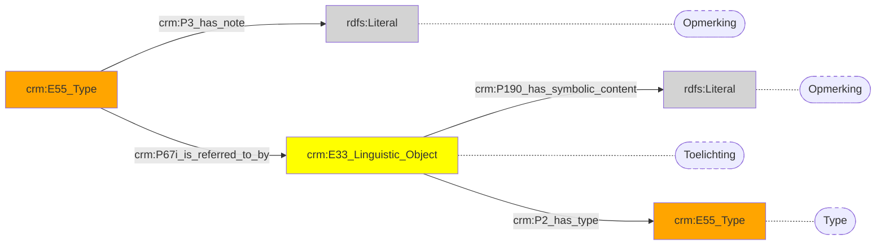

```mermaid
graph LR
style 3d9e0c30-1765-11ef-8a13-960002548b4f fill:#ffff00
style 3d9e1bbc-1765-11ef-887b-960002548b4f fill:#D3D3D3
style 3d9e28d7-1765-11ef-8232-960002548b4f fill:#D3D3D3
style 3d9e2b00-1765-11ef-a104-960002548b4f fill:#ffa500
style 3d9e333e-1765-11ef-af32-960002548b4f fill:#ffa500
3d9e0c30-1765-11ef-8a13-960002548b4f["crm:E33_Linguistic_Object"]-->|"crm:P190_has_symbolic_content"|3d9e28d7-1765-11ef-8232-960002548b4f(rdfs:Literal)
3d9e2b00-1765-11ef-a104-960002548b4f["crm:E55_Type"]-->|"crm:P3_has_note"|3d9e1bbc-1765-11ef-887b-960002548b4f(rdfs:Literal)
3d9e28d7-1765-11ef-8232-960002548b4f["rdfs:Literal"]-.-3d9e28d7-1765-11ef-8232-960002548b4f_s(["Opmerking"])
3d9e333e-1765-11ef-af32-960002548b4f["crm:E55_Type"]-.-3d9e333e-1765-11ef-af32-960002548b4f_s(["Type"])
3d9e1bbc-1765-11ef-887b-960002548b4f["rdfs:Literal"]-.-3d9e1bbc-1765-11ef-887b-960002548b4f_s(["Opmerking"])
3d9e0c30-1765-11ef-8a13-960002548b4f["crm:E33_Linguistic_Object"]-.-3d9e0c30-1765-11ef-8a13-960002548b4f_s(["Toelichting"])
style 3d9e28d7-1765-11ef-8232-960002548b4f_s stroke-dasharray: 5
style 3d9e333e-1765-11ef-af32-960002548b4f_s stroke-dasharray: 5
style 3d9e1bbc-1765-11ef-887b-960002548b4f_s stroke-dasharray: 5
style 3d9e0c30-1765-11ef-8a13-960002548b4f_s stroke-dasharray: 5
3d9e0c30-1765-11ef-8a13-960002548b4f["crm:E33_Linguistic_Object"]-->|"crm:P2_has_type"|3d9e333e-1765-11ef-af32-960002548b4f["crm:E55_Type"]
3d9e2b00-1765-11ef-a104-960002548b4f["crm:E55_Type"]-->|"crm:P67i_is_referred_to_by"|3d9e0c30-1765-11ef-8a13-960002548b4f["crm:E33_Linguistic_Object"]
```
