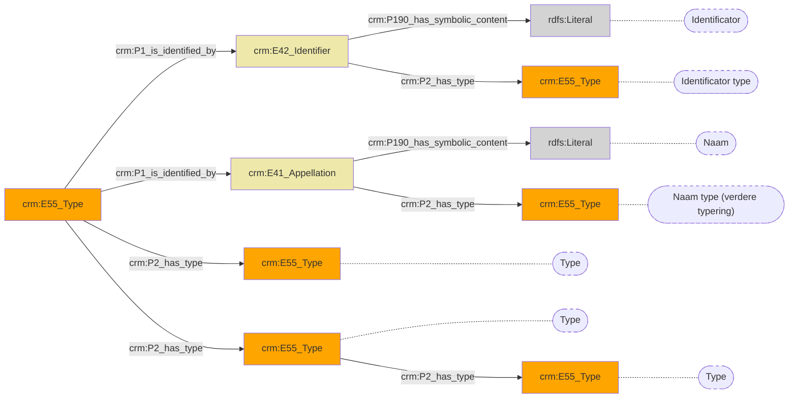

```mermaid
graph LR
style 2f941ad1-18e4-11ef-8836-960002548b4f fill:#EEE8AA
style 2f942006-18e4-11ef-ac7a-960002548b4f fill:#D3D3D3
style 2f94220d-18e4-11ef-94d2-960002548b4f fill:#ffa500
style 3d9e158f-1765-11ef-bd9c-960002548b4f fill:#EEE8AA
style 3d9e2332-1765-11ef-b178-960002548b4f fill:#ffa500
style 3d9e26d6-1765-11ef-8ed4-960002548b4f fill:#ffa500
style 3d9e2b00-1765-11ef-a104-960002548b4f fill:#ffa500
style 3d9e2bdb-1765-11ef-a9f8-960002548b4f fill:#ffa500
style 3d9e2cbf-1765-11ef-97a0-960002548b4f fill:#D3D3D3
style 3d9e318a-1765-11ef-b206-960002548b4f fill:#ffa500
2f941ad1-18e4-11ef-8836-960002548b4f["crm:E42_Identifier"]-->|"crm:P190_has_symbolic_content"|2f942006-18e4-11ef-ac7a-960002548b4f(rdfs:Literal)
3d9e158f-1765-11ef-bd9c-960002548b4f["crm:E41_Appellation"]-->|"crm:P190_has_symbolic_content"|3d9e2cbf-1765-11ef-97a0-960002548b4f(rdfs:Literal)
style 2f942006-18e4-11ef-ac7a-960002548b4f_s stroke-dasharray: 5
style 2f94220d-18e4-11ef-94d2-960002548b4f_s stroke-dasharray: 5
style 3d9e2cbf-1765-11ef-97a0-960002548b4f_s stroke-dasharray: 5
style 3d9e2bdb-1765-11ef-a9f8-960002548b4f_s stroke-dasharray: 5
style 3d9e318a-1765-11ef-b206-960002548b4f_s stroke-dasharray: 5
style 3d9e2332-1765-11ef-b178-960002548b4f_s stroke-dasharray: 5
style 3d9e26d6-1765-11ef-8ed4-960002548b4f_s stroke-dasharray: 5
2f942006-18e4-11ef-ac7a-960002548b4f["rdfs:Literal"]-.-2f942006-18e4-11ef-ac7a-960002548b4f_s(["Identificator"])
2f94220d-18e4-11ef-94d2-960002548b4f["crm:E55_Type"]-.-2f94220d-18e4-11ef-94d2-960002548b4f_s(["Identificator type"])
3d9e2cbf-1765-11ef-97a0-960002548b4f["rdfs:Literal"]-.-3d9e2cbf-1765-11ef-97a0-960002548b4f_s(["Naam"])
3d9e2bdb-1765-11ef-a9f8-960002548b4f["crm:E55_Type"]-.-3d9e2bdb-1765-11ef-a9f8-960002548b4f_s(["Naam type (verdere typering)"])
3d9e318a-1765-11ef-b206-960002548b4f["crm:E55_Type"]-.-3d9e318a-1765-11ef-b206-960002548b4f_s(["Type"])
3d9e2332-1765-11ef-b178-960002548b4f["crm:E55_Type"]-.-3d9e2332-1765-11ef-b178-960002548b4f_s(["Type"])
3d9e26d6-1765-11ef-8ed4-960002548b4f["crm:E55_Type"]-.-3d9e26d6-1765-11ef-8ed4-960002548b4f_s(["Type"])
2f941ad1-18e4-11ef-8836-960002548b4f["crm:E42_Identifier"]-->|"crm:P2_has_type"|2f94220d-18e4-11ef-94d2-960002548b4f["crm:E55_Type"]
3d9e158f-1765-11ef-bd9c-960002548b4f["crm:E41_Appellation"]-->|"crm:P2_has_type"|3d9e2bdb-1765-11ef-a9f8-960002548b4f["crm:E55_Type"]
3d9e26d6-1765-11ef-8ed4-960002548b4f["crm:E55_Type"]-->|"crm:P2_has_type"|3d9e318a-1765-11ef-b206-960002548b4f["crm:E55_Type"]
3d9e2b00-1765-11ef-a104-960002548b4f["crm:E55_Type"]-->|"crm:P1_is_identified_by"|2f941ad1-18e4-11ef-8836-960002548b4f["crm:E42_Identifier"]
3d9e2b00-1765-11ef-a104-960002548b4f["crm:E55_Type"]-->|"crm:P1_is_identified_by"|3d9e158f-1765-11ef-bd9c-960002548b4f["crm:E41_Appellation"]
3d9e2b00-1765-11ef-a104-960002548b4f["crm:E55_Type"]-->|"crm:P2_has_type"|3d9e2332-1765-11ef-b178-960002548b4f["crm:E55_Type"]
3d9e2b00-1765-11ef-a104-960002548b4f["crm:E55_Type"]-->|"crm:P2_has_type"|3d9e26d6-1765-11ef-8ed4-960002548b4f["crm:E55_Type"]
```
