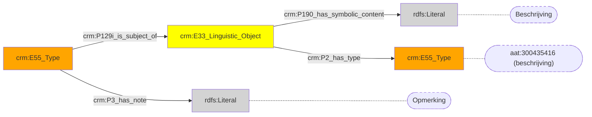

```mermaid
graph LR
style 3d9e1bbc-1765-11ef-887b-960002548b4f fill:#D3D3D3
style 3d9e2501-1765-11ef-853e-960002548b4f fill:#ffff00
style 3d9e2b00-1765-11ef-a104-960002548b4f fill:#ffa500
style 3d9e341a-1765-11ef-92c9-960002548b4f fill:#D3D3D3
style 3d9e34f8-1765-11ef-9acc-960002548b4f fill:#ffa500
3d9e2501-1765-11ef-853e-960002548b4f["crm:E33_Linguistic_Object"]-->|"crm:P190_has_symbolic_content"|3d9e341a-1765-11ef-92c9-960002548b4f(rdfs:Literal)
3d9e2b00-1765-11ef-a104-960002548b4f["crm:E55_Type"]-->|"crm:P3_has_note"|3d9e1bbc-1765-11ef-887b-960002548b4f(rdfs:Literal)
3d9e2501-1765-11ef-853e-960002548b4f["crm:E33_Linguistic_Object"]-->|"crm:P2_has_type"|3d9e34f8-1765-11ef-9acc-960002548b4f["crm:E55_Type"]
3d9e2b00-1765-11ef-a104-960002548b4f["crm:E55_Type"]-->|"crm:P129i_is_subject_of"|3d9e2501-1765-11ef-853e-960002548b4f["crm:E33_Linguistic_Object"]
style 3d9e341a-1765-11ef-92c9-960002548b4f_s stroke-dasharray: 5
style 3d9e34f8-1765-11ef-9acc-960002548b4f_s stroke-dasharray: 5
style 3d9e1bbc-1765-11ef-887b-960002548b4f_s stroke-dasharray: 5
3d9e341a-1765-11ef-92c9-960002548b4f["rdfs:Literal"]-.-3d9e341a-1765-11ef-92c9-960002548b4f_s(["Beschrijving"])
3d9e34f8-1765-11ef-9acc-960002548b4f["crm:E55_Type"]-.-3d9e34f8-1765-11ef-9acc-960002548b4f_s(["aat:300435416 (beschrijving)"])
3d9e1bbc-1765-11ef-887b-960002548b4f["rdfs:Literal"]-.-3d9e1bbc-1765-11ef-887b-960002548b4f_s(["Opmerking"])
```
